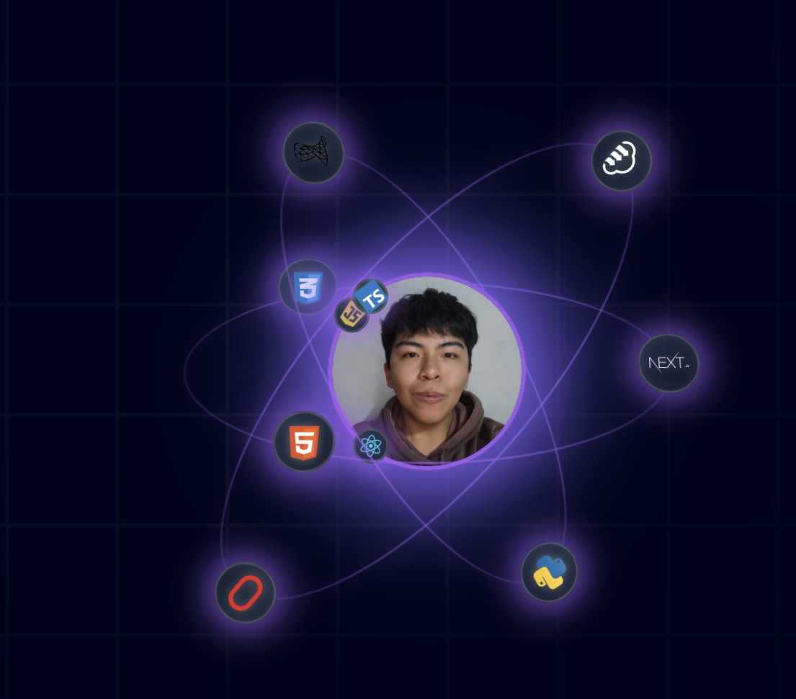

<div align="center">
  <br />
  
  <br />
  <div>
    
    
    
    
  </div>
  <h3 align="center">Portafolio Personal - Gianfranco Nuñez Delzo</h3>
  <div align="center">
    Este portafolio muestra mi trabajo, proyectos relevantes, experiencia y metodología de desarrollo. Incluye animaciones avanzadas como el <b>AnimatedProfile</b> (ver imagen arriba), ejemplos prácticos por semana, y recursos descargables. ¡Explora cada semana para ver ejemplos prácticos y recursos!
  </div>
</div>

## 📋 <a name="table">Table of Contents</a>

1. 🤖 [Introduction](#introduction)
2. ⚙️ [Tech Stack](#tech-stack)
3. 🔋 [Features](#features)
4. 🤸 [Quick Start](#quick-start)
5. 🕸️ [Code to Copy](#snippets)
6. 🔗 [Assets](#links)
7. 🚀 [More](#more)


## � Sobre el Proyecto

Este portafolio está construido con Next.js, Tailwind CSS, Three.js y Lucide Icons. Incluye secciones como:

- **Hero**: Presentación personal con efectos visuales y animaciones.
- **Mi Metodología**: Explicación de mi enfoque y proyectos relevantes destacados.
- **Proyectos Relevantes**: Tarjetas animadas con los proyectos más importantes.
- **Experiencia Laboral**: Trayectoria profesional y roles desempeñados.
- **Semanas de Aprendizaje**: Cada semana contiene ejemplos prácticos, reflexiones y recursos sobre tecnologías como React, Docker, Java, JSP, Spring y más.
- **Testimonios y Clientes**: Opiniones y empresas con las que he trabajado.


## 🤖 Introducción

Este portafolio es una muestra de mi crecimiento profesional y académico. Cada sección está pensada para resaltar mis habilidades técnicas, proyectos destacados y mi metodología de trabajo colaborativo. Incluye componentes visuales como <b>AnimatedProfile</b> (imagen atomprofile.jpg), tarjetas animadas, y recursos interactivos.


## ⚙️ Tecnologías Utilizadas


- Next.js
- Tailwind CSS
- Three.js
- Lucide Icons


## 🔋 Características

👉 **Presentación animada**
👉 **Tarjetas de proyectos relevantes**
👉 **Ejemplos prácticos por semana**
👉 **Animaciones y efectos visuales modernos**
👉 **Experiencia laboral y testimonios**
👉 **Metodología de trabajo**
👉 **Responsive design**


## 🤸 Instalación Rápida

Sigue estos pasos para ejecutar el portafolio en tu máquina local:

**Requisitos**
- [Git](https://git-scm.com/)
- [Node.js](https://nodejs.org/en)
- [npm](https://www.npmjs.com/)

**Clona el repositorio:**
```bash
git clone https://github.com/gianfranconunezdelzo-crypto/portafolio.git
cd portafolio
```

**Instala las dependencias:**
```bash
npm install
```

**Ejecuta el proyecto:**
```bash
npm run dev
```

Abre [http://localhost:3000](http://localhost:3000) en tu navegador para ver el portafolio.


## 🕸️ Estructura del Código

El portafolio está organizado en carpetas como:
- `/app/projects/semana-1` a `/app/projects/semana-7`: Cada semana tiene su propia página con ejemplos y recursos.
- `/components`: Componentes reutilizables para UI, animaciones y efectos (incluye <b>AnimatedProfile</b>).
- `/data/index.ts`: Datos de navegación, proyectos, experiencia y testimonios.
- `/public`: Imágenes y recursos estáticos importantes:
  - <b>atomprofile.jpg</b>: Imagen principal del componente AnimatedProfile.
  - <b>profile.png</b>: Foto de perfil utilizada en la animación.
  - <b>React.svg, JavaScript.svg, Next.js.svg, TypeScript.svg, HTML.svg, CSS.svg, python.svg, SQL.svg, oracle.svg, cloud.svg</b>: Iconos de tecnologías orbitando el perfil.
  - Otros recursos visuales y descargas.

<details>
<summary><code>tailwind.config.ts</code></summary>

```ts
import type { Config } from "tailwindcss";

const svgToDataUri = require("mini-svg-data-uri");

const colors = require("tailwindcss/colors");
const {
  default: flattenColorPalette,
} = require("tailwindcss/lib/util/flattenColorPalette");

const config = {
  darkMode: ["class"],
  content: [
    "./pages/**/*.{ts,tsx}",
    "./components/**/*.{ts,tsx}",
    "./app/**/*.{ts,tsx}",
    "./src/**/*.{ts,tsx}",
    "./data/**/*.{ts,tsx}",
  ],
  prefix: "",
  theme: {
    container: {
      center: true,
      padding: "2rem",
      screens: {
        "2xl": "1400px",
      },
    },
    extend: {
      colors: {
        black: {
          DEFAULT: "#000",
          100: "#000319",
          200: "rgba(17, 25, 40, 0.75)",
          300: "rgba(255, 255, 255, 0.125)",
        },
        white: {
          DEFAULT: "#FFF",
          100: "#BEC1DD",
          200: "#C1C2D3",
        },
        blue: {
          "100": "#E4ECFF",
        },
        purple: "#CBACF9",
        border: "hsl(var(--border))",
        input: "hsl(var(--input))",
        ring: "hsl(var(--ring))",
        background: "hsl(var(--background))",
        foreground: "hsl(var(--foreground))",
        primary: {
          DEFAULT: "hsl(var(--primary))",
          foreground: "hsl(var(--primary-foreground))",
        },
        secondary: {
          DEFAULT: "hsl(var(--secondary))",
          foreground: "hsl(var(--secondary-foreground))",
        },
        destructive: {
          DEFAULT: "hsl(var(--destructive))",
          foreground: "hsl(var(--destructive-foreground))",
        },
        muted: {
          DEFAULT: "hsl(var(--muted))",
          foreground: "hsl(var(--muted-foreground))",
        },
        accent: {
          DEFAULT: "hsl(var(--accent))",
          foreground: "hsl(var(--accent-foreground))",
        },
        popover: {
          DEFAULT: "hsl(var(--popover))",
          foreground: "hsl(var(--popover-foreground))",
        },
        card: {
          DEFAULT: "hsl(var(--card))",
          foreground: "hsl(var(--card-foreground))",
        },
      },
      borderRadius: {
        lg: "var(--radius)",
        md: "calc(var(--radius) - 2px)",
        sm: "calc(var(--radius) - 4px)",
      },
      keyframes: {
        "accordion-down": {
          from: { height: "0" },
          to: { height: "var(--radix-accordion-content-height)" },
        },
        "accordion-up": {
          from: { height: "var(--radix-accordion-content-height)" },
          to: { height: "0" },
        },
        spotlight: {
          "0%": {
            opacity: "0",
            transform: "translate(-72%, -62%) scale(0.5)",
          },
          "100%": {
            opacity: "1",
            transform: "translate(-50%,-40%) scale(1)",
          },
        },
        shimmer: {
          from: {
            backgroundPosition: "0 0",
          },
          to: {
            backgroundPosition: "-200% 0",
          },
        },
        moveHorizontal: {
          "0%": {
            transform: "translateX(-50%) translateY(-10%)",
          },
          "50%": {
            transform: "translateX(50%) translateY(10%)",
          },
          "100%": {
            transform: "translateX(-50%) translateY(-10%)",
          },
        },
        moveInCircle: {
          "0%": {
            transform: "rotate(0deg)",
          },
          "50%": {
            transform: "rotate(180deg)",
          },
          "100%": {
            transform: "rotate(360deg)",
          },
        },
        moveVertical: {
          "0%": {
            transform: "translateY(-50%)",
          },
          "50%": {
            transform: "translateY(50%)",
          },
          "100%": {
            transform: "translateY(-50%)",
          },
        },
        scroll: {
          to: {
            transform: "translate(calc(-50% - 0.5rem))",
          },
        },
      },
      animation: {
        "accordion-down": "accordion-down 0.2s ease-out",
        "accordion-up": "accordion-up 0.2s ease-out",
        spotlight: "spotlight 2s ease .75s 1 forwards",
        shimmer: "shimmer 2s linear infinite",
        first: "moveVertical 30s ease infinite",
        second: "moveInCircle 20s reverse infinite",
        third: "moveInCircle 40s linear infinite",
        fourth: "moveHorizontal 40s ease infinite",
        fifth: "moveInCircle 20s ease infinite",
        scroll:
          "scroll var(--animation-duration, 40s) var(--animation-direction, forwards) linear infinite",
      },
    },
  },
  plugins: [
    require("tailwindcss-animate"),
    addVariablesForColors,
    function ({ matchUtilities, theme }: any) {
      matchUtilities(
        {
          "bg-grid": (value: any) => ({
            backgroundImage: `url("${svgToDataUri(
              `<svg xmlns="http://www.w3.org/2000/svg" viewBox="0 0 32 32" width="100" height="100" fill="none" stroke="${value}"><path d="M0 .5H31.5V32"/></svg>`
            )}")`,
          }),
          "bg-grid-small": (value: any) => ({
            backgroundImage: `url("${svgToDataUri(
              `<svg xmlns="http://www.w3.org/2000/svg" viewBox="0 0 32 32" width="8" height="8" fill="none" stroke="${value}"><path d="M0 .5H31.5V32"/></svg>`
            )}")`,
          }),
          "bg-dot": (value: any) => ({
            backgroundImage: `url("${svgToDataUri(
              `<svg xmlns="http://www.w3.org/2000/svg" viewBox="0 0 32 32" width="16" height="16" fill="none"><circle fill="${value}" id="pattern-circle" cx="10" cy="10" r="1.6257413380501518"></circle></svg>`
            )}")`,
          }),
        },
        { values: flattenColorPalette(theme("backgroundColor")), type: "color" }
      );
    },
  ],
} satisfies Config;

function addVariablesForColors({ addBase, theme }: any) {
  let allColors = flattenColorPalette(theme("colors"));
  let newVars = Object.fromEntries(
    Object.entries(allColors).map(([key, val]) => [`--${key}`, val])
  );

  addBase({
    ":root": newVars,
  });
}

export default config;
```

</details>

<details>
<summary><code>globals.css</code></summary>

```css
@tailwind base;
@tailwind components;
@tailwind utilities;

@layer base {
  :root {
    --background: 0 0% 100%;
    --foreground: 240 10% 3.9%;

    --card: 0 0% 100%;
    --card-foreground: 240 10% 3.9%;

    --popover: 0 0% 100%;
    --popover-foreground: 240 10% 3.9%;

    --primary: 240 5.9% 10%;
    --primary-foreground: 0 0% 98%;

    --secondary: 240 4.8% 95.9%;
    --secondary-foreground: 240 5.9% 10%;

    --muted: 240 4.8% 95.9%;
    --muted-foreground: 240 3.8% 46.1%;

    --accent: 240 4.8% 95.9%;
    --accent-foreground: 240 5.9% 10%;

    --destructive: 0 84.2% 60.2%;
    --destructive-foreground: 0 0% 98%;

    --border: 240 5.9% 90%;
    --input: 240 5.9% 90%;
    --ring: 240 10% 3.9%;

    --radius: 0.5rem;
  }

  .dark {
    --background: 240 10% 3.9%;
    --foreground: 0 0% 98%;

    --card: 240 10% 3.9%;
    --card-foreground: 0 0% 98%;

    --popover: 240 10% 3.9%;
    --popover-foreground: 0 0% 98%;

    --primary: 0 0% 98%;
    --primary-foreground: 240 5.9% 10%;

    --secondary: 240 3.7% 15.9%;
    --secondary-foreground: 0 0% 98%;

    --muted: 240 3.7% 15.9%;
    --muted-foreground: 240 5% 64.9%;

    --accent: 240 3.7% 15.9%;
    --accent-foreground: 0 0% 98%;

    --destructive: 0 62.8% 30.6%;
    --destructive-foreground: 0 0% 98%;

    --border: 240 3.7% 15.9%;
    --input: 240 3.7% 15.9%;
    --ring: 240 4.9% 83.9%;
  }
}

@layer base {
  * {
    @apply border-border !scroll-smooth;
  }
  body {
    @apply bg-background text-foreground;
  }
  button {
    @apply active:outline-none;
  }
}

@layer utilities {
  .heading {
    @apply font-bold text-4xl md:text-5xl text-center;
  }

  .black-gradient {
    background: linear-gradient(90deg, #161a31 0%, #06091f 100%);
  }
}
```

</details>


<details>
<summary><code>Linear Gradient</code></summary>

```js
style={{
        //   add these two
        //   you can generate the color from here https://cssgradient.io/
        background: "rgb(4,7,29)",
        backgroundColor:
          "linear-gradient(90deg, rgba(4,7,29,1) 0%, rgba(12,14,35,1) 100%)",
      }}
```
</details>


## 🔗 Recursos y Assets

Las imágenes y recursos utilizados se encuentran en la carpeta `/public` y en el archivo `/data/index.ts`. Puedes personalizarlos para tu propio portafolio. Ejemplos destacados:

<div align="center">
  
  
  
  
  
  
  
  
  
  
  
  
</div>
